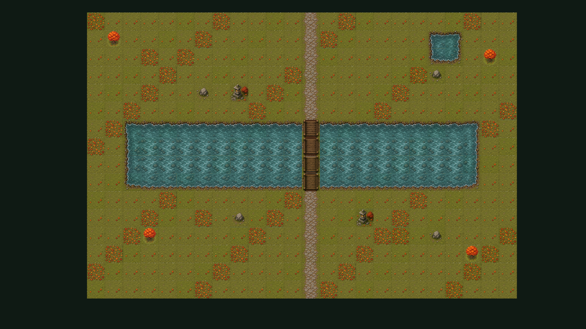
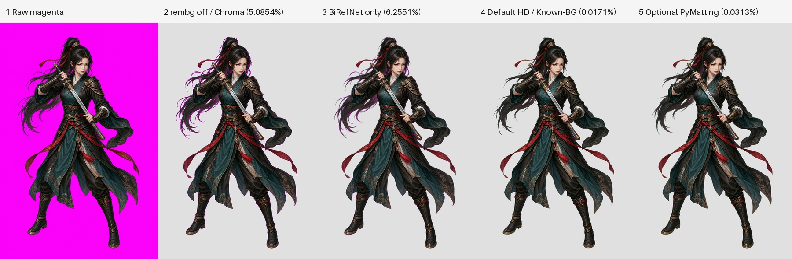

# Game Visual Forge

English | [简体中文](README.zh-CN.md)

Game Visual Forge is a repository-local collection of three Codex Skills for
game-ready 2D visual assets: maps, sprites, and video-to-sprite animation.
Ask in natural language; the selected Skill turns the request into a validated
asset bundle or an engine-ready handoff.

## Skills

| Skill | Use it for | Typical output |
| --- | --- | --- |
| [`forge-2d-map`](skills/forge-2d-map/SKILL.md) | Playable 2D maps, Tilemaps, terrain, props, collision, and Unity handoff | Map bundle, preview, placement data, quality evidence |
| [`forge-2d-sprite`](skills/forge-2d-sprite/SKILL.md) | Characters, creatures, NPCs, props, effects, and animation sheets | Clean sprite sheets, frames, GIF previews, metadata |
| [`forge-video-to-sprite`](skills/forge-video-to-sprite/SKILL.md) | Turning a selected video or generated motion clip into dense sprite frames | Extracted frames, sprite strips, GIF previews, metadata |

## What it provides

- Natural-language intake with explicit choices for style, layout, runtime, and
  delivery format.
- Built-in image generation when a new visual asset is needed, plus support for
  user-provided source media.
- Deterministic local processing, validation reports, and reproducible output
  manifests.
- Playable map handoff with walkability, collision, objects, entrances, and
  Unity Tilemap support.
- Provider, cost, and submission confirmation gates for paid or external work.

## Showcase

### Playable map handoff



The map example includes a Tilemap bundle, separate layers, bridge
connectivity, collision data, and Unity acceptance evidence.

### HD sprite cleanup



The cleanup is local and layered rather than a single opaque filter:

- Pillow converts RGBA images and writes the transparent PNG/GIF outputs.
- NumPy/SciPy support alpha masks and known-background reconstruction.
- rembg uses the default `birefnet-general` model for semantic foreground
  separation, which preserves hair, fabric, and other soft edges better than a
  plain color key.
- The known-magenta reconstruction pass removes color spill from anti-aliased
  edges. If CUDA fails, the processor tries CPU; if model execution still
  fails, it reports the reason and uses deterministic Chroma fallback.
- Optional PyMatting can refine difficult semi-transparent edges, but it is
  slower and is not guaranteed to improve every asset.

#### Install HD cleanup

Use the project extras first, then choose the rembg ONNX Runtime backend that
matches your machine:

```powershell
# Pillow-only local image processing
python -m pip install -e ".[image]"

# rembg, NumPy, and SciPy for HD cleanup
python -m pip install -e ".[background]"

# Choose one backend: CPU is the compatibility default; GPU needs CUDA support
python -m pip install "rembg[cpu]"
python -m pip install "rembg[gpu]"

# Optional PyMatting refinement, after choosing a rembg backend
python -m pip install -e ".[matting]"
```

Initialize the default model once so the project can reuse its local cache:

```powershell
python -c "from rembg import new_session; new_session('birefnet-general')"
```

Models are stored under `U2NET_HOME` when it is set, otherwise under
`~/.u2net`. Set `U2NET_HOME` to a writable shared model directory if needed.
The repository never installs dependencies, downloads models, or selects a
GPU silently. Use CPU for compatibility, GPU for repeated high-resolution
batches on a verified CUDA environment, Chroma for fast solid-key input, and
PyMatting only when extra soft-edge refinement is worth the cost.

## Install

Use the repository locally or follow the platform-specific guide:

- [Codex installation](install/codex/README.md)
- [Claude installation](install/claude/README.md)

The install guides are manual and repository-local. They do not install
providers, FFmpeg, credentials, or dependencies automatically.

## Example requests

```text
Use forge-2d-map to create a top-down village with a north-south creek,
one walkable wooden bridge, building entrances, collision, and a Unity Tilemap.
```

```text
Use forge-2d-sprite to create a modern pixel-art player walk sheet with
transparent output and a preview GIF.
```

```text
Use forge-video-to-sprite with my existing MP4 and export a feet-aligned
24-frame sprite strip plus a preview GIF.
```

## Unity integration

The Unity package lives at
[`integrations/unity/com.game-visual-forge.tilemap`](integrations/unity/com.game-visual-forge.tilemap).
It imports a validated Tilemap bundle into reusable textures, Tiles, Palette,
and Tilemap Prefab assets. The package includes EditMode and PlayMode tests.

## Repository layout

```text
skills/       Codex Skill instructions and launchers
src/          Shared contracts, routing, processing, and reports
integrations/ Unity Tilemap package and tests
assets/       Small checked-in examples and showcase artifacts
install/      Manual setup guides
```

## Development check

```powershell
python -m unittest discover -s tests -q
```

## License

[MIT](LICENSE)
