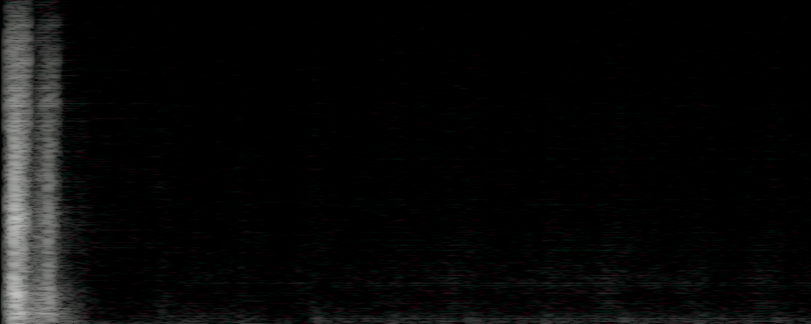

# Game Visual Forge

[English](README.md) | 简体中文

Game Visual Forge 是一个仓库内使用的四个 Codex Skills 集合，覆盖可游玩的
2D 地图、2D 精灵、视频转精灵，以及用户明确提出的游戏音效制作。

## Skills

| Skill | 用于 | 常见输出 |
| --- | --- | --- |
| [`forge-2d-map`](skills/forge-2d-map/SKILL.md) | 可行走的 2D 地图、Tilemap、地形、道具、碰撞和 Unity 交付 | 地图包、预览、放置数据、质量证据 |
| [`forge-2d-sprite`](skills/forge-2d-sprite/SKILL.md) | 角色、生物、NPC、道具、特效和动画图集 | 透明精灵图集、帧文件、GIF 预览、元数据 |
| [`forge-video-to-sprite`](skills/forge-video-to-sprite/SKILL.md) | 将现有或由海螺/MiniMax、即梦及可选 ComfyUI MiniMax H3 生成的视频转换为精灵帧。 | 抽帧、精灵条、GIF 预览、元数据 |
| [`forge-text-audio`](skills/forge-text-audio/SKILL.md) | 明确请求的 SFX、UI 音效、动作音效和环境音 | 审核后的 44,100 Hz 16-bit PCM WAV 与 Unity AudioClip 清单 |

## 提供的能力

- 通过自然语言收集风格、布局、运行时和交付格式等关键选择。
- 需要新视觉素材时使用内置生图，也支持用户提供已有素材。
- 使用确定性的本地处理、验证报告和可复现输出清单。
- 地图交付包含可行走区域、碰撞、对象、入口和 Unity Tilemap 支持。
- 原生图集会在验证前按声明的网格、Tile 尺寸、边距和间距标准化；这只统一图集几何，不修复画面、接缝或地图拓扑。
- 对付费或外部操作提供 Provider、费用和提交确认门槛。
- `forge-video-to-sprite` 使用 FFmpeg/FFprobe、本地时间戳抽帧、rembg/Chroma 清理、稳定对齐、图集、GIF 预览和运动质量证据处理现有视频。
- 视频生成支持明确选择现有、海螺/MiniMax、即梦或可选 ComfyUI MiniMax H3 路线；工具和凭据由用户手动配置，不会自动切换。
- `forge-text-audio` 使用隔离的官方 Stable Audio 3 `small-sfx` 本地运行时，支持 text-to-audio、redraw、inpaint 和 continue，只交付 WAV，并要求最终试听审核。

## 展示


HD 清理使用 Pillow 进行图像转换，使用 NumPy/SciPy 生成遮罩，使用带有
`birefnet-general` 模型的 rembg 进行语义分离，处理已知洋红色溢出，并可选用
PyMatting 做细化。CUDA 失败时会尝试 CPU，并在需要时报告确定性的 Chroma 回退。

手动安装可选清理工具：

```powershell
python -m pip install -e ".[image]"
python -m pip install -e ".[background]"
python -m pip install "rembg[cpu]"
python -m pip install "rembg[gpu]"
python -m pip install -e ".[matting]"
python -c "from rembg import new_session; new_session('birefnet-general')"
```

可使用 `U2NET_HOME` 指定共享模型目录。CPU 是兼容性默认选项；GPU 需要已验证
的 CUDA 环境。PyMatting 是可选项，速度更慢。

### Stable Audio 3 示例

以下音效由 `forge-text-audio` 使用官方
`stabilityai/stable-audio-3-small-sfx` 模型生成。

#### 木质 UI 点击

提示词：

```text
Dry wooden UI click, short transient, no music, no voice
```

[试听木质 UI 点击音效](assets/readme/stable-audio-3-small-sfx-wooden-ui-click.wav)




#### 生成打铁音效

提示词：

```text
TrackType: SFX, a clean professional studio Foley recording of one natural strike of a small steel blacksmith hammer against a red-hot iron billet on a solid anvil, an isolated metallic impact with a fast attack and a short clean natural decay, recorded with a dry close microphone in a quiet room.
```

- [试听打铁候选 1](assets/readme/stable-audio-3-small-sfx-blacksmith-hammer-01.wav)
- [试听打铁候选 2](assets/readme/stable-audio-3-small-sfx-blacksmith-hammer-02.wav)
- [试听打铁候选 3](assets/readme/stable-audio-3-small-sfx-blacksmith-hammer-03.wav)

实现与验证：使用 Stable Audio 3 Small-SFX 在本地生成，经无增益 WAV 处理，并通过格式、削波和持续噪声检查。

## 安装

- [统一安装指南](install/README.zh-CN.md)
- [统一安装指南英文版](install/README.md)
- [Stable Audio 3 安装指南](install/stable-audio-3/README.zh-CN.md)
- [Comfy MCP 官方安装说明](https://docs.comfy.org/agent-tools/mcp#installation)
- [MiniMax H3 Prompt Writing Skill 官方安装说明](https://github.com/MiniMax-AI/MiniMax-H3/blob/main/skills/README.md#installation)

统一指南同时包含可复制给 Agent 的请求和完整手动安装流程。核心流程只安装四个
Forge Skills。可选工作流必须由用户主动选择启用；Agent 会先询问是否启用，先检查，
再在安装缺失组件前二次确认。

Provider 配置与核心 Skill 安装分开处理。核心安装不会自动安装 Provider、
FFmpeg、凭据、模型权重或可选工作流依赖。

需要 Agent 安装音效运行时时，复制下面这句话：

> 请为 forge-text-audio 安装并配置官方 stable-audio-3：先询问我安装目录，将独立 Python 环境、模型和全部缓存放入该目录；许可证必须由我本人确认，禁止调用托管 API；安装完成后在 game-visual-forge 仓库中运行 provider configure 命令创建本地配置，不修改用户环境变量或 PATH，最后运行离线预检并报告结果。

详细说明见 [Stable Audio 3 安装指南](install/stable-audio-3/README.zh-CN.md)。`provider configure` 会创建只保存本地路径的 `game-visual-forge.local.json`。

## 请求示例

```text
使用 forge-2d-map 制作俯视角村落：南北向小溪、一座可通行木桥、建筑入口、碰撞和 Unity Tilemap。
```

```text
使用 forge-2d-sprite 制作现代像素风玩家行走图，输出透明图集和 GIF 预览。
```

```text
使用 forge-video-to-sprite 处理我提供的 MP4，导出脚部对齐的 24 帧精灵条和 GIF 预览。
```

```text
使用 forge-video-to-sprite 和本地 ComfyUI MiniMax H3，从我的首帧图优化 I2VA
提示词，然后导出对齐的 16 帧与 32 帧精灵图集。
```

```text
使用 forge-text-audio 制作三组干燥的铁剑击中钢盾音效，不要音乐或人声，审核候选并准备 Unity AudioClip。
```

本地视频处理需要手动安装 FFmpeg 和 FFprobe。海螺/MiniMax API 使用
`MINIMAX_API_KEY`；即梦 API 使用 `JIMENG_ACCESS_KEY` 和
`JIMENG_SECRET_KEY`；官方 `mmx` 与 `dreamina` CLI 是可选项。

## Unity 集成

Tilemap 包位于
[`integrations/unity/com.game-visual-forge.tilemap`](integrations/unity/com.game-visual-forge.tilemap)，
负责将已验证地图包导入纹理、Tiles、Palette 和 Tilemap Prefab。独立的音频包位于
[`integrations/unity/com.game-visual-forge.audio`](integrations/unity/com.game-visual-forge.audio)，
负责导入审核后的 WAV 和配置 AudioClip，不修改场景。只有用户明确要求时，才通过 Unity MCP 放置场景对象。

## 仓库结构

```text
skills/       Codex Skill 说明和启动器
src/          共享合同、路由、处理和报告
integrations/ Unity Tilemap 与音频包及测试
assets/       小型示例和展示素材
install/      统一安装与独立运行时指南
```

## 开发检查

请在包含 `tests/` 的仓库根目录运行：

```powershell
Set-Location "game-visual-forge项目路径"
python -m unittest discover -s tests -q
```

## 许可证

[MIT](LICENSE)
