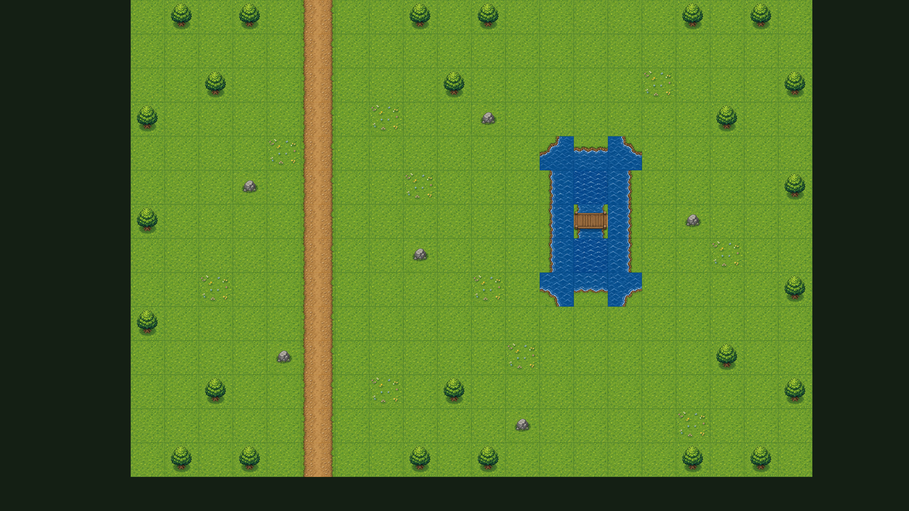
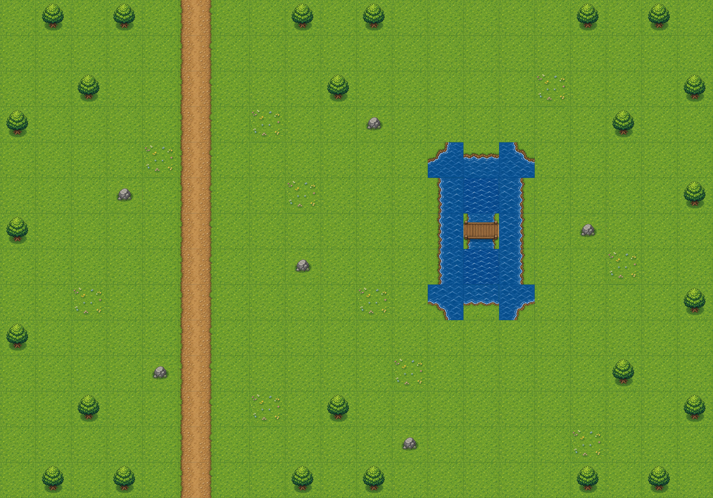
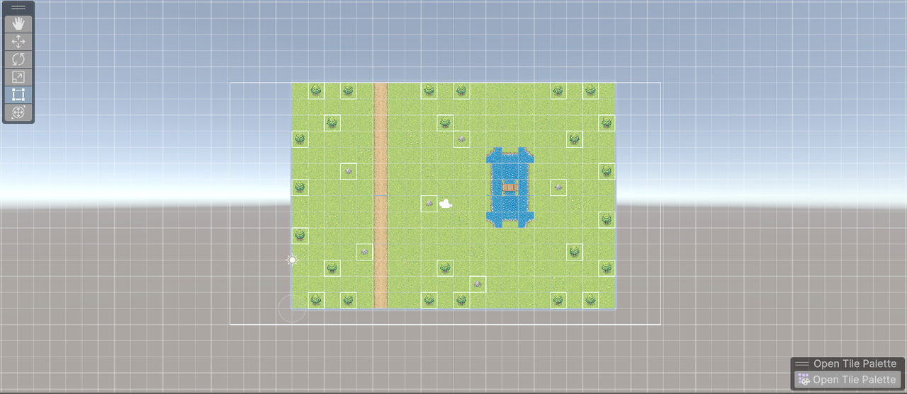
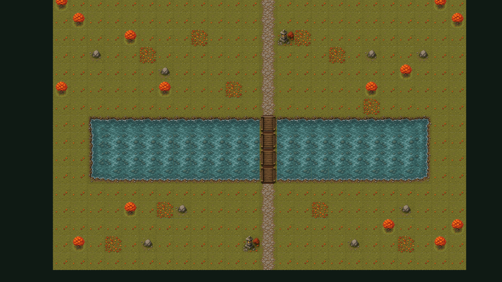
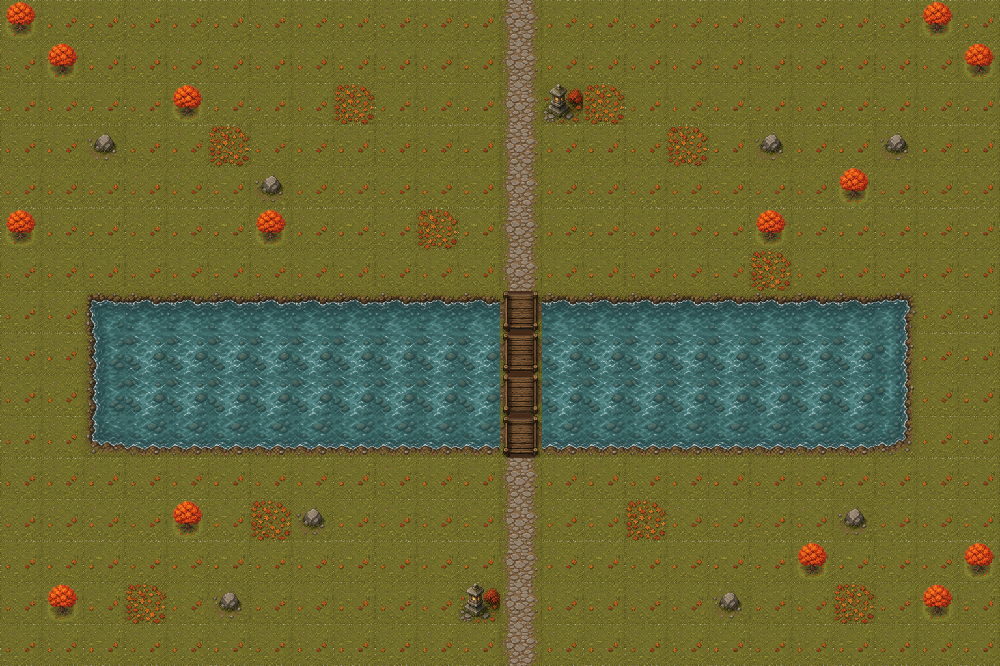
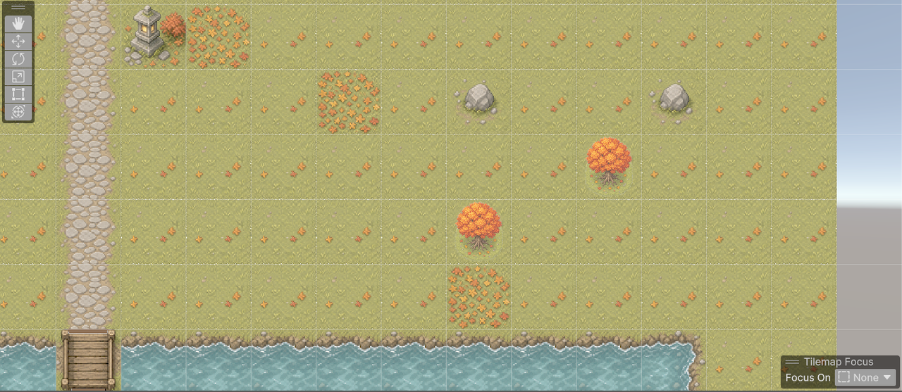
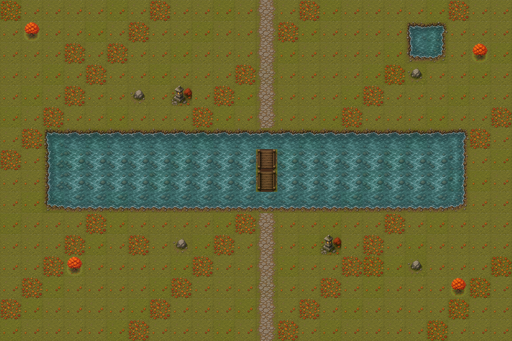
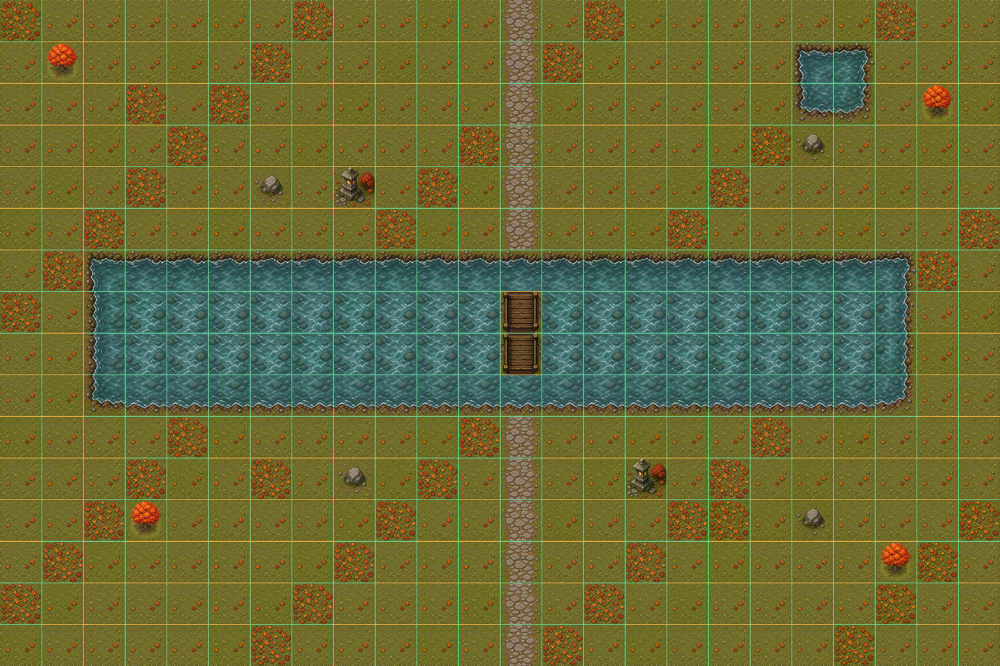
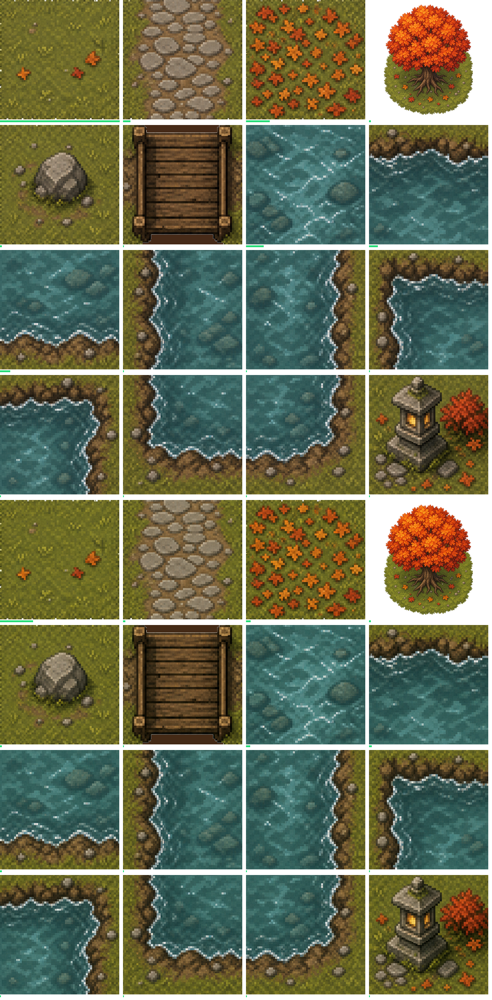
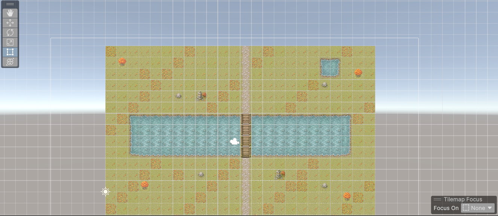

# Game Visual Forge

### Tile 模式与 Unity Tilemap

Tile 模式把生成或已有的 Tileset PNG 作为视觉来源，并输出中立、带版本的交付包：
`tileset.png`、`tileset-slices.json`、`tilemap-placement.json`、
`unity-tilemap.json` 和 `tilemap-preview.png`。请求中的单元格数组采用左上角起点的
逐行顺序；给 Unity 使用的切片矩形和摆放坐标采用左下角起点。

```powershell
python skills/forge-2d-map/scripts/run.py map tile plan `
  --request <tilemap-request.json> --out-dir <output> --now <utc-rfc3339>
python skills/forge-2d-map/scripts/run.py map tile route `
  --request <output>/tilemap-request.json --capabilities <capabilities.json> `
  --out <output>/source-decision.json --state <output>/job-state.json `
  --now <utc-rfc3339>
```

随后执行 `map tile ingest`、`map tile process` 和 `map tile validate`。
Unity 2022.3 LTS / Unity 6 导入器位于
`integrations/unity/com.game-visual-forge.tilemap`，需要在 Unity Package Manager
中通过 **Add package from disk** 明确安装。Package 声明依赖
`com.unity.2d.sprite` 和 `com.unity.2d.tilemap`；导入器本身不会自动安装依赖，
也不会修改当前打开的 Scene。安装后，从 **Tools > Game Visual Forge > Import
Tilemap Bundle** 选择 `unity-tilemap.json`，它会在 `generated_root` 下创建或更新
切片 Sprite、Tile 资源、Tile Palette 和多图层 Tilemap Prefab。默认使用 Point
过滤、关闭纹理压缩；当 pixels-per-unit 等于 Tile 宽度时，一个 Tile 对应一个
Unity 单位。

Package 还提供了可选的 Unity 测试，位于 `Tests/Editor` 和 `Tests/PlayMode`。
在消费项目的 `Packages/manifest.json` 中，把本 Package 加入 `testables` 后即可在
Unity Test Runner 中运行。EditMode 会检查 Tile 数量、Palette 内容、图层顺序、有效
单元格和障碍物碰撞器；PlayMode 提供运行时样例检查。本次还通过 Unity MCP 验证了当前
示例场景：运行时包含 3 个 Tilemap、TilemapRenderer 和碰撞器。两套示例 Bundle 各自
连续导入两次后，均保持 16 个 Tile，且 Tilemap Prefab GUID 不变。

#### Tile 尺寸模式

Tile 请求严格使用以下模式之一：

| 用户请求 | 模式 | 最终尺寸 |
| --- | --- | --- |
| 未指定尺寸 | `preset_32` | 32×32 |
| 16×16 | `preset_16` | 16×16 |
| 其他任意正数宽×高 | `custom` | 用户请求的尺寸 |

未指定尺寸时默认使用 `preset_32`。用户明确请求 16×18 时使用 `custom`；
16×18 仅在请求时支持，不是独立预设。最小请求示例：

```json
{"tile_size_mode":"preset_16"}
{"tile_size_mode":"preset_32"}
{"tile_size_mode":"custom","tile_width":16,"tile_height":18}
```

同一请求中的所有图集页必须共享同一种 Tile 尺寸。Unity 根据尺寸和 PPU
推导 Grid Cell Size：`(tile_width / pixels_per_unit, tile_height / pixels_per_unit, 1)`。

### Unity 成功案例

#### 标准简易森林地图

第一张端到端地图是 20×14 的俯视角森林地图，包含纵向土路、3×5 的池塘和桥梁，
以及树木、岩石和花朵，用于验证基础的双层 Tilemap 交付流程。







运行结果：

- 4×4 图集共生成 16 个 Tile；地图尺寸为 20×14；使用 Point 过滤，每个 Unity 单位对应 256 像素。
- 两个图层共包含 280 个地面摆放和 41 个细节摆放。
- Unity 导入和场景摆放成功，确定性检查与人工视觉检查全部通过。
- 结果文件：[Unity Bundle](assets/readme/standard-simple-map-unity-tilemap.json)、[质量报告](assets/readme/standard-simple-map-quality-report.json) 和 [Tilemap 摆放数据](assets/readme/standard-simple-map-tilemap-placement.json)。

#### 枫叶溪谷地图

第二次端到端地图流程使用生成的 4×4 秋季 Tileset，构建 24×16 的俯视角溪谷关卡。
中央石路通过木桥跨过四格宽的溪流，树木、岩石、落叶和灯笼分别输出到不同的
Tilemap 图层。







运行结果：

- 生成 4×4、1024×1024 图集，共 16 个 Tile；使用 Point 过滤，每个 Unity 单位对应 256 像素。
- 三个图层共包含 384 个地面摆放、28 个细节摆放和 22 个障碍物摆放。
- Unity 导入成功，并在 `Assets/Scenes/SampleScene.unity` 中生成 `AutumnCreekMapDemo`。
- 确定性检查通过：源图尺寸、产物可读性、栅格尺寸和 Unity Bundle 契约。
- 人工视觉检查通过：接缝、可读性、图层顺序、碰撞图层以及无文字/水印。
- `obstacles` Tilemap 使用 `TilemapCollider2D`，导入后场景已保存且无未保存修改。
- 原先被裁切的 `tree-canopy` 已重新生成成完整的单格树木，包含完整树冠、树干、树根和透明边缘。

结果文件：[Unity Bundle](assets/readme/autumn-creek-map-unity-tilemap.json)、
[质量报告](assets/readme/autumn-creek-map-quality-report.json)、
[Tileset 提示词](assets/readme/autumn-creek-tileset.prompt.txt)、
[树木修复提示词](assets/readme/tree-canopy-replacement.prompt.txt) 和
[Tilemap 摆放数据](assets/readme/autumn-creek-map-tilemap-placement.json)。

#### 自适应河流穿越地图（32 Tile / 双图集页 HD）

这是当前验收通过的 `adaptive-river-crossing-map-tilemap` 测试案例，独立于
`AutumnCreekMapDemo` 和 `StandardSimpleMapDemo`；后两者仍作为已有参考案例保留。
本案例有意复用已经验证过的枫叶溪谷 Tile 语义，先验证多图集页和动态 Tile 数量
契约，同时避免不同图集之间出现不兼容的视觉语义。

地图尺寸为 24×16，包含四格宽的横向溪流、纵向石路和木桥穿越、右上角小池塘，
以及连贯的草地、落叶、树木、岩石和灯笼细节。交付包包含 32 个 Tile 资源、两张
4×4 图集页和三个图层（`ground`、`details`、`obstacles`）。第二页使用相同视觉
语义的备用 Tile ID，用于验证图集页绑定和重复导入；这不是宣称有 32 种完全不同的
视觉图案。
第二页相对于第一页采用确定性的轻微色彩变化，因此两个图集页是真实不同的文件，
但仍保持相同的视觉语法和可读性。










验收结果：

- Python 确定性检查和人工视觉检查全部通过：接缝、可读性、图层顺序、碰撞层、邻接关系、裁切和无文字/水印。
- 声明的 32 个 Tile ID 全部被使用，没有未使用、被裁切或非法邻接的 Tile。
- Assets-only Unity 导入生成两张图集纹理、32 个 Tile 资源、Palette Prefab 和 Tilemap Prefab，且不改变场景布局。
- 干净的 Assets-only 运行结果为 `scene_action=unchanged`、`scene_dirty=false`，没有改变场景布局。
- 重复 Import and Place 具备幂等性：第一次结果为 `scene_action=placed`，第二次为 `scene_action=updated`；两次都确认资源 GUID 稳定，最终层级中只有一个 v8 adaptive 实例。
- Unity 导入报告记录了两张图集页、32 个 Tile、三个图层和 v8 Prefab 路径。显式摆放测试会让编辑器场景保持 dirty，但流程不会自动保存 Scene。
- [Unity 验收汇总](assets/readme/adaptive-river-crossing-map-unity-acceptance-summary.json) 保留了 Assets-only 结果（`had_existing_assets=false`、`scene_action=unchanged`）、第一次摆放（`placed`）、第二次幂等更新（`updated`）、稳定 GUID 和最终实时层级检查（`AutumnCreekMapDemo=false`、`StandardSimpleMapDemo=false`、adaptive 实例数为 1）。

结果文件：[地图预览](assets/readme/adaptive-river-crossing-map-preview.png)、
[接缝预览](assets/readme/adaptive-river-crossing-map-seam-preview.png)、
[Tile 使用率](assets/readme/adaptive-river-crossing-map-tile-usage-preview.png)、
[地图质量报告](assets/readme/adaptive-river-crossing-map-map-quality-report.json)、
[资产清单](assets/readme/adaptive-river-crossing-map-asset-manifest.json)、
[Unity 导入报告](assets/readme/adaptive-river-crossing-map-unity-import-report.json) 和
[Unity 验收汇总](assets/readme/adaptive-river-crossing-map-unity-acceptance-summary.json)。

### 可选：标准化交付尺寸

当游戏需要统一尺寸和锚点时，可在请求中设置 `delivery_normalization`。流程会保留原有的
透明 `frames/` 输出，然后按每帧可见 alpha 边界裁切，对整个动画使用同一缩放比例，并在
`delivery/` 下额外导出标准化交付包。落地角色使用 `feet`，道具或悬浮资产使用 `center`。

```json
"delivery_normalization": {
  "canvas_width": 1024,
  "canvas_height": 1024,
  "anchor": "feet",
  "fit_scale": 0.88
}
```

这是交付布局步骤，不会改善抠图本身；它可能让细微色边不那么显眼，但也会柔化细天线、手指或
发丝。manifest 会记录标准化交付包的源裁切边界和共享缩放比例。

[English](README.md) | 简体中文

Game Visual Forge 是一组独立的 Agent Skills，用于生成 2D Sprite、面向生产的
2D 地图，以及 Video -> 2D Sprite 动画。

### M0 范围

M0 提供版本化数据契约、安全的任务状态、零网络执行计划和三个 Skill 基础骨架。
M0 不调用真实生成 Provider，也不生成媒体文件。

### M2 二维地图基础管线

M2 增加结构化的 `MapRequest`，并为已有底图提供离线地图流程：
`map plan -> map route -> map ingest -> map process -> map validate`。
第一批输出 `base-map.png`、`map-runtime.json`、`walkable-mask.png`、
`collision-mask.png` 和 `debug-preview.png`。

地图几何使用与画布一致的整数像素坐标。可行走遮罩为
`walk_bounds - blockers`，碰撞遮罩为可行走遮罩的反集。`zones` 会写入运行时
元数据和调试预览，但不会改变碰撞。出生点必须位于画布内、可行走且不在阻挡物中，
才能通过确定性质量检查；发布前仍需要人工完成视觉确认。

```powershell
python skills/forge-2d-map/scripts/run.py map plan `
  --request <map-request.json> --out-dir <output> --now <utc-rfc3339>
python skills/forge-2d-map/scripts/run.py map route `
  --request <output>/map-request.json --capabilities <capabilities.json> `
  --out <output>/source-decision.json --state <output>/job-state.json `
  --now <utc-rfc3339>
python skills/forge-2d-map/scripts/run.py map ingest `
  --request <output>/map-request.json --decision <output>/source-decision.json `
  --image <source.png> --repo-root <repo> --out <output>/raw-image.json `
  --state <output>/job-state.json --now <utc-rfc3339>
python skills/forge-2d-map/scripts/run.py map process `
  --request <output>/map-request.json --raw-image <output>/raw-image.json `
  --repo-root <repo> --out-dir <output> --state <output>/job-state.json `
  --now <utc-rfc3339>
python skills/forge-2d-map/scripts/run.py map validate `
  --request <output>/map-request.json --raw-image <output>/raw-image.json `
  --processing-result <staging>/processing-result.json --repo-root <repo> `
  --staging-dir <staging> --final-dir <output>/final `
  --state <output>/job-state.json --now <utc-rfc3339>
```

M2 仍要求显式确认服务商、模型、参数、数量和费用，不会静默重试未知提交状态。

### M1 二维精灵生成

M1 增加版本化 `SpriteRequest`、明确的 `CapabilityRouter` 路由决策、服务商付费
确认门禁、本地图像导入、确定性的帧/图集/GIF 处理、`QualityReport` 和
`AssetManifest`。

已有图像、Agent 原生图像和未来的第三方图像都会进入同一条本地处理路径。Pillow
是本地图像处理的可选依赖，rembg 是可选的背景移除后端；系统不会自动安装它们。

### HD 背景移除

对于使用纯色 `#FF00FF` 背景生成的 HD 精灵，可通过
`pip install -e ".[background]"` 安装默认高质量后端。运行时先使用 CUDA 执行
BiRefNet-General，失败后使用 CPU 重试；只有 rembg 不可用或所有可用 Provider 都失败时，
才降级到确定性的洋红色键抠图。


本次对比使用同一张 1024 x 1536 生成图。alpha 不低于 8/255 的像素视为可见像素。
洋红占比等于“可见的洋红近似像素数 ÷ 全部可见像素数”，因此衡量的是角色内部及边缘
的颜色污染，不受空白画布面积影响。

| 结果 | 适用情况 | 洋红像素 | 可见像素 | 占比 |
| --- | --- | ---: | ---: | ---: |
| Chroma Fallback | rembg 不可用，需要人工检查 | 24,799 | 487,649 | 5.0854% |
| BiRefNet Only | 语义处理中间结果，不直接导出 | 31,081 | 496,889 | 6.2551% |
| 默认 HD / Known-BG | 推荐的最终输出 | 81 | 472,640 | 0.0171% |
| 可选 PyMatting | 显式启用的精细模式 | 151 | 482,322 | 0.0313% |

Chroma Fallback 直接移除接近已知洋红键色的像素，不需要模型且结果确定；但是头发和
衣摆的抗锯齿边缘已经混入前景色与洋红色，因此仍会留下可见轮廓。默认 HD 路径先融合
BiRefNet 语义 alpha 与从画布边缘连通的色键证据，再根据已知洋红背景反推前景颜色；
对不稳定的低 alpha 像素，则使用附近可靠的前景颜色修复。PyMatting 根据同一个融合
遮罩建立 Trimap，再分别求解 alpha 和前景颜色。它可通过
`pip install -e ".[matting]"` 安装并使用 `"rembg_refinement": "pymatting"`
显式启用，但由于计算开销更大且在本图上没有更好，默认保持关闭。表中数据只代表本次
验证图，并不是所有图片上的通用模型排名。

### 路由与安全规则

- 已有图像优先。
- 没有已有图像时检查 Agent 原生图像工具；支持时使用原生路径。
- 原生能力不支持 -> 由用户选择第三方 Provider、本地工具或已有素材。
- 原生生成失败或质量不达标 -> 只有在确认后，才能进入既定兜底或选择流程。
- 每次使用即梦或通义万相，都必须明确确认 Provider、模型、参数、数量、费用、币种和请求指纹。
- 不得根据凭证、登录状态或历史选择自动选择服务商，不得静默重新提交付费任务。
- `submission_unknown` 只能查询或人工核对。
- M2 不包含视频、MP4、FFmpeg、自动安装依赖或自动付费重试。

### 安装

- [Codex 安装指南](install/codex/README.md)
- [Claude 安装指南](install/claude/README.md)

### 验证命令

```powershell
python -m unittest discover -s tests -v
python skills/forge-2d-sprite/scripts/run.py sprite plan `
  --request <request.json> --out-dir <output> --now <utc-rfc3339>
```

### 自适应 Tilemap 质量流程

Tile 模式提供两个配置：`standard_16` 保持旧版单个 4×4 图集、最多 16 个
Tile；`adaptive_hd` 支持 16、32 或 48 个 Tile，并使用 1–3 个 4×4 图集页。
使用重复的 `--atlas-page page-01=path.png` 参数显式绑定每个图集页。

处理器会输出地图、接缝、使用率预览、质量指标和 `map-quality-report.json`。
Unity 提供 **Assets-only** 和显式 **Import and Place** 两种导入方式；后者会复用
Prefab 实例，但不会自动保存 Scene。`Reports/unity-import-report.json` 记录 Python
报告 SHA-256、图集页数、Tile 数量、Palette、Prefab 和场景操作。碰撞层/遮罩是可选的
地图空间数据；游戏逻辑不在本项目范围内。普通运行不会自动改写 README。
